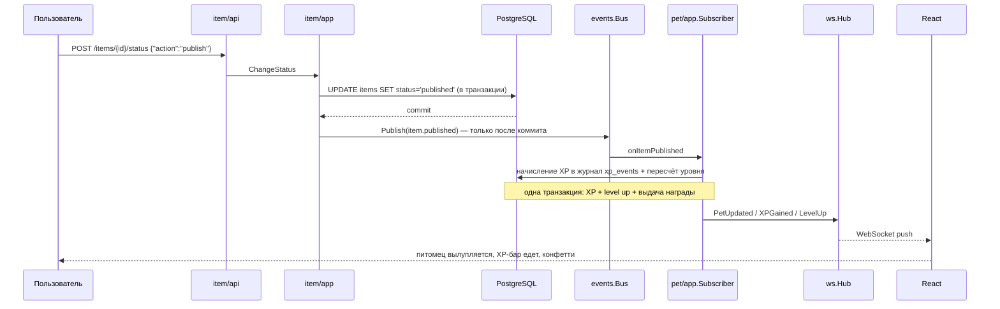

# Авито Тамагочи — «Енот Ноти»

Геймификация поверх доски объявлений. Виртуальный енот, который растёт не от кнопки «покормить»,
а от **реальных действий пользователя на Авито**: публикации объявлений, продаж, добавлений в
избранное, ежедневных заходов. Награды за уровни конвертируются обратно в целевые действия —
промокоды на доставку, скидки на продвижение и Автотеку.

Ключевая продуктовая идея: **питомец — зеркало твоей активности, а не отдельная игра**.
Опубликовал объявление — енот поел и подрос. Не заходил два дня — загрустил и проголодался.
Заполнил объявление качественно (фото, цена, описание) — вырос быстрее. Так игровая петля
напрямую тянет метрики площадки: публикации, качество контента, retention.

Подробное продуктовое обоснование — в [docs/CASE.md](docs/CASE.md), инженерный план работ — в
[docs/PLAN.md](docs/PLAN.md), полная спецификация API с примерами curl — в
[docs/API.md](docs/API.md), инструкция по деплою на VPS — в [deploy/README.md](deploy/README.md).

---

## Быстрый старт

Нужны только **Docker** и **Docker Compose v2**. Ни Go, ни Node.js локально не требуются —
всё собирается в контейнерах.

```bash
git clone https://github.com/GoatWhistle/avito-hack.git
cd avito-hack
cp .env.example .env
```

Открыть `.env` и заполнить три обязательных значения (без них бэкенд откажется стартовать):

```bash
POSTGRES_PASSWORD=любой_пароль
JWT_SECRET=минимум_16_символов_случайной_строки
REWARD_HMAC_SECRET=минимум_16_символов_другой_случайной_строки
```

`DATABASE_URL` в `.env` должен содержать тот же пароль, что и `POSTGRES_PASSWORD`.

```bash
docker compose up -d --build
```

Первая сборка занимает 3–5 минут. Compose сам выдерживает порядок: postgres → миграции →
бэкенд → фронтенд.

| Что | Адрес |
| --- | --- |
| Фронтенд | `http://localhost:3000` |
| API | `http://localhost:8080/api/v1` |
| Health | `http://localhost:8080/healthz` |
| Readiness (проверяет БД) | `http://localhost:8080/readyz` |
| Метрики Prometheus | `http://localhost:8080/metrics` |

Проверить, что всё поднялось:

```bash
docker compose ps
curl -s http://localhost:8080/healthz   # {"status":"ok"}
curl -s http://localhost:8080/readyz    # {"status":"ready"}
```

Остановить: `docker compose down`. Удалить вместе с данными: `docker compose down -v`.

Полезные команды (`make help` покажет весь список):

```bash
make up            # собрать и поднять стек, дождаться healthy
make logs SERVICE=backend LOGS_TAIL=50
make migrate       # применить миграции
make seed          # пересоздать демо-данные
make test          # тесты бэкенда и фронтенда
make lint          # линтеры, лимит длины файлов, синхронность локалей
make down          # остановить
```

---

## Демо-сценарий для проверяющего

Полный сквозной путь занимает около трёх минут. Все шаги — через UI на `http://localhost:3000`.

### Вариант 1: пройти путь с нуля (показывает основную механику)

1. **Регистрация.** Открыть `http://localhost:3000`, зарегистрироваться: почта, пароль и ФИО.
   Жёстких требований к паролю нет — проверка сведена к минимуму, чтобы демо не спотыкалось
   о правила. Сразу после регистрации создаётся **яйцо** — питомец ещё не вылупился.
2. **Главный экран.** Виден енот в стадии `egg`, уровень 1, 0 XP, параметры сытости, настроения
   и энергии. WebSocket подключается автоматически с access-токеном.
3. **Опубликовать объявление.** Раздел объявлений → создать: заголовок, цена, описание
   **длиннее 200 символов**, загрузить фото. Затем сменить статус на `published`.
4. **Реакция в реальном времени.** Не перезагружая страницу: питомец вылупляется, прилетает
   `+XP`, полоска прогресса едет. Это push по WebSocket, а не поллинг — событие `item.published`
   прошло через шину в pet-модуль и вернулось в UI.
5. **Ещё XP.** Добавить чужое объявление в избранное (+1 XP, лимит 5/день), зайти на следующий
   день (ежедневный чек-ин, streak). При наборе порога уровня приходит `level.up` и награда.
6. **Награды.** Раздел наград: каталог с прогрессом к каждому условию и «мои награды» с
   промокодами. Активировать выданный промокод — статус меняется на `activated`, повторная
   активация возвращает ошибку.
7. **Лидерборд.** Заполнен демо-пользователями из сида, показывает позицию.

### Вариант 2: войти готовым аккаунтом (быстрее, видно прокачанное состояние)

Демо-аккаунты приезжают миграцией `00005_seed_demo_data.sql` автоматически.
**Пароль у всех одинаковый: `demo1234`.**

| Почта | Имя | Уровень | Стадия | Streak | Чем интересен |
| --- | --- | --- | --- | --- | --- |
| `anna@demo.avito` | Анна Ковалёва | 15 | legend | 41 | максимальный уровень, 3 бейджа, активированный и невыданный промокоды |
| `boris@demo.avito` | Борис Гурьев | 13 | adult | 22 | взрослый питомец, два промокода |
| `dasha@demo.avito` | Дарья Лебедева | 10 | adult | 11 | середина лидерборда |
| `zhanna@demo.avito` | Жанна Орлова | 7 | teen | 6 | истёкшая награда (статус `expired`) |
| `ivan@demo.avito` | Иван Дорофеев | 6 | teen | 4 | **голодный и грустный питомец** — параметры просели по времени |
| `maria@demo.avito` | Мария Тарасова | 2 | baby | 1 | не заходил 3 дня, сильная деградация параметров |
| `nikita@demo.avito` | Никита Белов | 1 | egg | 0 | **невылупившееся яйцо** — состояние сразу после регистрации |

Аккаунт `ivan@demo.avito` и `maria@demo.avito` удобны, чтобы увидеть механику деградации:
их `last_decay_time` в прошлом, и при первом же чтении состояния сытость с настроением
пересчитываются вниз по формуле, без всяких фоновых задач.

Проверка того же самого через API — примеры curl в [docs/API.md](docs/API.md).

---

## Архитектура

### Общая схема

```text
┌──────────────────────────────────────────────────────────────────┐
│  React 18 + TypeScript (Vite, AntD, Effector, React Query)        │
│  REST — источник правды, WebSocket — канал push-уведомлений       │
└───────────────┬──────────────────────────────┬───────────────────┘
                │ HTTP /api/v1                 │ WSS /api/v1/ws?token=
┌───────────────▼──────────────────────────────▼───────────────────┐
│  Go + chi                                                         │
│  ┌─────────┬─────────┬──────────┬─────────┬─────────┐             │
│  │  user   │  item   │ favorite │   pet   │ raccoon │  модули     │
│  └─────────┴────┬────┴─────┬────┴────▲────┴─────────┘             │
│                 │          │         │                            │
│                 └── events.Bus ──────┘  внутрипроцессная шина     │
│  shared: auth, apierr, pagination, ws.Hub, clock, postgres/tx     │
└───────────────┬───────────────────────────────┬──────────────────┘
                │                               │
        ┌───────▼────────┐              ┌───────▼────────┐
        │  PostgreSQL 16 │              │    Redis 7     │
        │ источник правды│              │ кэш питомца 5м │
        └────────────────┘              └────────────────┘
```

### Слои внутри модуля

Каждый модуль (`internal/module/<name>/`) разложен на четыре слоя со строгим направлением
зависимостей `api → app → domain` и `infra → domain`:

| Слой | Что внутри | Что запрещено (проверяет depguard) |
| --- | --- | --- |
| `domain` | агрегаты с приватными полями и геттерами, инварианты, чистые правила экономики | не знает про pgx, net/http, chi, encoding/json и другие модули |
| `app` | сценарии использования, порты (интерфейсы) к внешнему миру | не знает про HTTP, chi и pgx |
| `infra` | репозитории на pgx, кэш на Redis, работа с файлами | — |
| `api` | HTTP-хендлеры, DTO, маршруты | не трогает pgx напрямую |

Модуль никогда не импортирует внутренности другого модуля — только порты, объявленные в
собственном `app/ports.go`. Слой `shared` не знает про модули вообще. Эти правила не на словах:
они физически проверяются линтером `depguard`, и нарушение валит CI.

### Поток события: от действия пользователя до анимации в UI

Именно этот путь даёт вау-момент демо — жюри публикует объявление и видит реакцию мгновенно.



Ключевые решения этого потока:

- **Событие публикуется только после коммита** транзакции. Иначе питомец успел бы отреагировать
  на действие, которое потом откатилось.
- **Модуль `item` ничего не знает о питомце.** Он эмитит факт «объявление опубликовано»;
  `pet` — единственный подписчик. Направление зависимостей сохранено, item тестируется
  без питомца.
- **Ошибки бизнес-правил питомца не ломают исходное действие.** Если XP не начислился, потому
  что сработал дневной лимит или идемпотентность (`ErrDuplicateAction`, `ErrLimitReached`),
  подписчик молча пропускает событие — объявление всё равно опубликовано.
- **REST — источник правды, WebSocket — оптимизация.** При реконнекте фронтенд перезапрашивает
  состояние через REST. Потерянный push не приводит к рассинхрону.

### Стадии и уровни

Пороги XP жёстко заданы в `pet/domain/progression.go` (уровни 1–15): 0, 5, 12, 22, 35, 52, 72,
95, 122, 155, 195, 240, 290, 350, 420. Стадия выводится из уровня и не хранится отдельно как
источник правды: `egg` (до вылупления) → `baby` (1–5) → `teen` (6–9) → `adult` (10–14) →
`legend` (15).

Параметры питомца (сытость, настроение, энергия, все 0–100) считаются **лениво**: в базе лежит
значение на момент `last_decay_time`, а при каждом чтении применяется
`state(now) = clamp(state(last) + rate × часы)`. Сытость −2/час, настроение −1.5/час, энергия
+5/час, накопление ограничено 14 днями. Никаких фоновых задач и крона: проще, надёжнее и
полностью детерминированно в тестах с фиксированными часами.

Параметры влияют на экономику: сытость ниже 30 — множитель XP ×0.5, настроение от 70 —
множитель ×1.25. Питомец никогда не умирает и не убегает — это осознанное продуктовое решение,
негативная мотивация убивает retention в утилитарных продуктах.

---

## API

Все маршруты под префиксом `/api/v1`. Авторизация — `Authorization: Bearer <token>`.
Полные примеры запросов и ответов — в [docs/API.md](docs/API.md).

### Аутентификация и пользователи

| Метод | Путь | Авторизация | Назначение |
| --- | --- | --- | --- |
| POST | `/auth/register` | нет | Регистрация, возвращает токен и профиль |
| POST | `/auth/login` | нет | Вход, возвращает токен и профиль |
| GET | `/users/me` | обязательна | Профиль текущего пользователя |
| PATCH | `/users/me` | обязательна | Изменить отображаемое имя |

### Объявления

| Метод | Путь | Авторизация | Назначение |
| --- | --- | --- | --- |
| GET | `/items` | опциональна | Список объявлений, keyset-пагинация, фильтры `status`, `owner_id`, `search` |
| GET | `/items/{id}` | опциональна | Одно объявление |
| GET | `/items/mine` | обязательна | Мои объявления |
| POST | `/items` | обязательна | Создать (статус `draft`) |
| PATCH | `/items/{id}` | обязательна, владелец | Изменить поля |
| POST | `/items/{id}/status` | обязательна, владелец | Смена статуса: `submit`, `publish`, `sell`, `archive`, `restore` |
| GET | `/items/{id}/photos` | опциональна | Фотографии объявления |
| POST | `/items/{id}/photos` | обязательна, владелец | Загрузить фото (multipart, jpeg/png/webp, до 5 МБ) |
| DELETE | `/items/{id}/photos/{photoID}` | обязательна, владелец | Удалить фото |

Статус-машина: `draft → moderation → published → sold`, плюс `archived` и восстановление.
Переход `publish` разрешён **владельцу напрямую** — иначе основной сценарий кейса заблокирован
(см. «Ограничения MVP»). Переход `sell` терминальный и даёт питомцу крупное начисление.

### Избранное

| Метод | Путь | Авторизация | Назначение |
| --- | --- | --- | --- |
| POST | `/items/{id}/favorite` | обязательна | Добавить в избранное (даёт XP, лимит 5/день) |
| DELETE | `/items/{id}/favorite` | обязательна | Убрать из избранного |
| GET | `/favorites` | обязательна | Мои избранные, keyset-пагинация |

### Питомец и прогресс

| Метод | Путь | Авторизация | Назначение |
| --- | --- | --- | --- |
| GET | `/pet` | обязательна | Состояние питомца: стадия, уровень, XP, сытость, настроение, энергия. Параметры пересчитываются на момент запроса |
| POST | `/pet/actions/stroke` | обязательна | Погладить — поднимает настроение, без лимита |
| POST | `/checkin` | обязательна | Ежедневный чек-ин: двигает серию, начисляет XP. Идемпотентен в пределах суток |
| GET | `/progress` | обязательна | Уровень, XP, сколько осталось до следующего уровня, серия |
| GET | `/leaderboard` | обязательна | Рейтинг с позицией пользователя, keyset-пагинация, параметр `around=me` для соседей |

### Награды и бейджи

| Метод | Путь | Авторизация | Назначение |
| --- | --- | --- | --- |
| GET | `/rewards` | обязательна | Каталог наград с прогрессом к каждой — что получено, что близко, что далеко |
| GET | `/rewards/my` | обязательна | Полученные награды с промокодами и статусами |
| POST | `/rewards/{id}/activate` | обязательна | Активировать промокод. Проверяется подпись и владелец, повторная активация невозможна |
| GET | `/raccoon/profile` | обязательна | Профиль питомца с бейджами (совместимость с фронтендом) |
| GET | `/badges/` | обязательна | Каталог бейджей со статусом получения |
| POST | `/rewards/claim` | обязательна | Забрать награду за уровень, вернуть подписанный промокод |

Наружу модуль называется «енот»/`raccoon`, внутри кода это модуль `pet` — один домен, одно место
правды. Публичные имена эндпоинтов сохранены, чтобы не переделывать фронтенд.

### Служебные

| Метод | Путь | Авторизация | Назначение |
| --- | --- | --- | --- |
| GET | `/healthz` | нет | Живость процесса |
| GET | `/readyz` | нет | Готовность, пингует БД |
| GET | `/metrics` | нет | Prometheus, RED-метрики по маршрутам |

Эти три пути — вне префикса `/api/v1`.

### Формат ошибок

Единый конверт для всех эндпоинтов (`shared/apierr`). Бэкенд **никогда не возвращает текст для
пользователя** — он возвращает стабильный машинный `code`, а фронтенд рисует перевод под текущую
локаль:

```json
{
  "error": {
    "code": "validation_error",
    "message": "field is required",
    "field": "email",
    "request_id": "b9f2c1a4-..."
  }
}
```

| `code` | HTTP | Когда |
| --- | --- | --- |
| `validation_error` | 400 | Невалидное поле, в `field` — какое именно |
| `bad_request` | 400 | Тело запроса не разобралось |
| `unauthorized` | 401 | Нет токена, истёк или подделан |
| `forbidden` | 403 | Действие не разрешено этой роли или не владельцу |
| `not_found` | 404 | Ресурс отсутствует |
| `conflict` | 409 | Нарушен инвариант: дубль, недопустимый переход статуса |
| `internal_error` | 500 | Всё остальное; наружу деталей нет, они в логах по `request_id` |

`request_id` возвращается в каждой ошибке и пишется в лог — по нему находится конкретный запрос.

### Пагинация

Везде keyset-курсор, никакого `OFFSET`: на глубоких страницах он деградирует и «прыгает» при
вставках. Курсор — base64url от `(created_at, id)`, лимит по умолчанию 20, максимум 100.

```json
{ "items": [ ... ], "next_cursor": "MjAyNi0wOC0wNVQxMDoxMjozMFo..." }
```

Пустой `next_cursor` означает конец выборки. Следующая страница: `?cursor=<next_cursor>&limit=20`.

---

## WebSocket-протокол

Реалтайм-состояние питомца — жёсткое требование ТЗ. Реализация: `coder/websocket`, hub в памяти
процесса (`shared/ws`), маршрут вынесен из-под общего `chimw.Timeout` — иначе таймаут запроса
рвал бы долгоживущее соединение.

### Подключение

```text
ws://localhost:8080/api/v1/ws?token=<access_token>
wss://ваш-домен/api/v1/ws?token=<access_token>   (на проде)
```

Токен передаётся **query-параметром**, а не заголовком: браузерный `WebSocket` не умеет
задавать заголовки при рукопожатии. Валидируется тем же verifier'ом, что и HTTP-запросы.
Без токена или с невалидным — `401` в конверте `apierr`, соединение не апгрейдится.
Origin проверяется по `ALLOWED_ORIGINS`.

### Клиент → сервер

Один конверт для всех сообщений, `request_id` опционален и возвращается в ответе — по нему
клиент сопоставляет ответ со своим запросом.

```json
{ "type": "ping",     "request_id": "1" }
{ "type": "pet.get",  "request_id": "2" }
{ "type": "pet.pet",  "request_id": "3" }
```

| `type` | Что делает |
| --- | --- |
| `ping` | Heartbeat, сервер отвечает `pong` |
| `pet.get` | Запросить актуальное состояние (с применённой деградацией) |
| `pet.pet` | Погладить питомца — безлимитно, поднимает настроение |

Всё остальное — обычным REST. WebSocket сознательно оставлен каналом уведомлений, а не вторым
API: так проще тестировать и отлаживать. Неизвестный `type` возвращает `error` с кодом
`unknown_message`, соединение остаётся живым. Лимит сообщения — 4096 байт.

### Сервер → клиент

Ответы на запросы клиента:

```json
{ "type": "pong",  "request_id": "1" }
{ "type": "pet.state", "request_id": "2", "payload": { ... } }
{ "type": "error", "request_id": "9", "payload": { "code": "unknown_message", "message": "unsupported message type" } }
```

Push-события, приходящие без запроса — их порождают действия пользователя на доске объявлений:

| `type` | `payload` | Когда |
| --- | --- | --- |
| `pet.updated` | полное состояние питомца | Любое изменение параметров |
| `xp.gained` | `{"amount": 2, "reason": "item.published", "total": 37}` | Начислен XP |
| `level.up` | `{"level": 4}` | Достигнут новый уровень |
| `reward.granted` | `{"reward_id": "free_delivery_500", "title": "Бесплатная доставка"}` | Выдана награда |
| `streak.updated` | `{"days": 7, "milestone": true}` | Изменилась серия заходов |

Формат `payload` у `pet.updated` и `pet.state` одинаковый:

```json
{
  "id": "e0000000-0000-4000-a000-000000000001",
  "user_id": "d0000000-0000-4000-a000-000000000001",
  "name": "Ноти",
  "stage": "legend",
  "level": 15,
  "xp": 455,
  "next_level_xp": 420,
  "satiety": 92,
  "happiness": 88,
  "streak_days": 41,
  "last_checkin_date": "2026-08-05T00:00:00Z",
  "last_decay_time": "2026-08-05T08:50:56Z",
  "updated_at": "2026-08-05T09:50:56Z"
}
```

### Поведение клиента

Авто-реконнект с экспоненциальной задержкой; после восстановления связи — рефетч состояния через
REST. Один пользователь может держать несколько вкладок: hub хранит `map[userID][]conn` и
рассылает событие во все соединения этого пользователя.

---

## Выбор базы данных и обоснование

### PostgreSQL 16 — основное хранилище

1. **Экономика требует ACID.** Начисление XP, повышение уровня и выдача награды — это одна
   транзакция. Если она разъедется, пользователь получит уровень без награды или награду дважды.
   Гонки решаются на уровне БД (`SELECT ... FOR UPDATE`, advisory-локи на пользователя,
   уникальные индексы), а не «аккуратным кодом» в приложении.
2. **Данные реляционные насквозь.** `users → pets → xp_events → user_rewards → items → favorites`.
   Это связи с внешними ключами и каскадами, а не документы. Журнал `xp_events` — классическая
   append-only таблица с агрегацией.
3. **Идемпотентность бесплатна.** `UNIQUE (user_id, action, subject_id)` на `xp_events` физически
   запрещает начислить XP дважды за одно объявление; `UNIQUE (user_id, reward_id)` на
   `user_rewards` — выдать награду дважды. Это инвариант схемы, а не проверка в коде, которую
   можно забыть.
4. **Лидерборд — обычный индексированный запрос.** Индекс `(level DESC, xp DESC, user_id)` на
   `pets` плюс keyset-пагинация. До сотен тысяч пользователей никакие sorted set не нужны, а
   позиция считается одним `COUNT(*) WHERE rating > my_rating`.
5. **CHECK-констрейнты дублируют доменные инварианты.** Параметры 0–100, уровень ≥ 1, допустимые
   статусы и стадии — если приложение когда-нибудь ошибётся, БД не даст записать мусор.

### Redis 7 — только кэш состояния питомца

Состояние читается на каждый заход и на каждое WS-сообщение, но меняется редко. Кэш с TTL 5 минут
снимает нагрузку, при этом **источник правды остаётся в Postgres**: при промахе читаем из БД, при
откате транзакции ключ инвалидируется, а параметры доигрываются деградацией по времени и после
попадания в кэш — питомец не «замерзает» на время TTL. Потеря Redis не теряет данные.

### Почему не Kafka

Мы держим один инстанс бэкенда. При одном инстансе брокер добавляет контейнер, сетевую задержку,
проблемы доставки и отладку — ради асинхронности, которая здесь не нужна: событий немного, они
обрабатываются за миллисекунды, а подписчик всего один. Внутрипроцессная шина
(`shared/events`) даёт то же разделение ответственности: `item` не знает про `pet`, они общаются
через типизированные события.

Путь миграции, если инстансов станет больше: интерфейсы `Publisher`/`Subscriber` уже есть, за
ними меняется реализация на Kafka или NATS, а хабу WebSocket добавляется Redis pub/sub, чтобы
push доходил до пользователя независимо от того, на каком инстансе висит его соединение.
Доменный код при этом не меняется вообще.

---

## Линтеры и обоснование правил

Проверяется одной командой: `make lint`. Всё то же самое гоняется в CI и в pre-commit.

### Backend — `.golangci.yaml`

| Правило | Настройка | Зачем |
| --- | --- | --- |
| `depguard` | 5 наборов запретов | **Главное правило проекта.** Делает слои физическими: `domain` не может импортировать pgx, `net/http`, chi, `encoding/json` и другие модули; `app` не знает про HTTP и pgx; `api` не лезет в pgx; `shared` не знает про модули. Архитектура ломается не на ревью, а в CI |
| `funlen` | 60 строк / 40 выражений | Функция, которая не влезает на экран, не читается. Заставляет выделять шаги в именованные функции вместо комментариев |
| `gocyclo` / `gocognit` | 15 / 20 | Ветвление — источник ошибок в экономике: лимиты, статусы, состояния. Ограничение выталкивает логику в таблицы переходов и чистые функции |
| `nestif` | 4 | Глубокая вложенность прячет пропущенный `else`. Провоцирует early return |
| `errcheck` | + type assertions, blank | Проглоченная ошибка в транзакции = молча потерянный XP |
| `errorlint` | вкл | Обязывает `errors.Is/As` и `%w`: доменные ошибки должны переживать обёртки, иначе `apierr` вернёт 500 вместо 400 |
| `gosec` | вкл | Криптография в подписи промокодов, работа с файлами при загрузке фото |
| `rowserrcheck`, `sqlclosecheck` | вкл | Незакрытые `rows` — утечка соединений пула |
| `contextcheck`, `noctx` | вкл | Каждый запрос к БД и внешним сервисам должен уметь отменяться |
| `exhaustive` | вкл | Добавили статус или стадию — компилятор напомнит про все `switch` |
| `lll` | 120 | Читаемость в ревью и в сплите редактора |
| `dupl` | порог 150 | Копипаста в хендлерах расползается быстрее всего |
| `nolintlint` | требует причину | `//nolint` без объяснения запрещён: подавление — осознанное решение |
| `gofumpt`, `goimports`, `gci` | локальный префикс | Единый порядок импортов, ноль конфликтов форматирования в диффах |

Дополнительно, вне golangci: **лимит 250 строк на файл** (`scripts/check-file-length.sh`).
Один use case — один файл, один эндпоинт — один хендлер. Это то, что реально держит модули
навигируемыми, когда над репозиторием одновременно работают четыре человека.

### Frontend — `eslint.config.js`

| Правило | Зачем |
| --- | --- |
| `boundaries/element-types` | FSD-слои на импортах: `app → pages → widgets → features → entities → shared`, снизу вверх — запрещено. Тот же принцип, что depguard на бэкенде |
| `boundaries/no-private` | Нельзя лезть во внутренности чужого слайса мимо его публичного API |
| `i18next/no-literal-string` | Ни одной строки в JSX мимо `t()`. Плюс `scripts/check-locales.mjs` следит, что ключ, добавленный в `ru`, не забыт в `en` |
| `no-restricted-syntax` на hex-цвета | Хардкод `#0af` запрещён — только токены из `@/shared/design`. Иначе тёмная тема разъезжается по компонентам |
| `import/no-default-export` | Именованные экспорты переживают переименования и нормально автоимпортятся; исключение — точки входа страниц для ленивой загрузки |
| `max-lines: 250` | Тот же лимит, что на бэкенде, ради консистентности |
| `strictTypeChecked` + запрет `any`, `no-unsafe-*` | Данные с бэкенда типизированы до самого UI; `any` пробивает дыру во всей цепочке |
| `no-warning-comments` | `TODO`/`FIXME` в коде запрещены — задачи живут в трекере, а не в исходниках |
| `no-floating-promises`, `no-misused-promises` | Необработанный промис в обработчике WS-события = молча потерянное обновление |
| `switch-exhaustiveness-check` | Добавили тип WS-события — TypeScript заставит его обработать |
| `react-hooks/exhaustive-deps` (error) | Устаревшие замыкания в подписке на WebSocket — классический источник «UI не обновляется» |

---

## Тесты

```bash
make test                                    # бэкенд + фронтенд с покрытием
cd src/backend && go test ./...              # только бэкенд
cd src/backend && go test -race ./...        # с детектором гонок
cd src/frontend && npm run test              # только фронтенд
```

Покрываем не всё подряд, а то, где ошибка стоит дорого и где логика нетривиальна:

| Что покрыто | Файл | Почему именно это |
| --- | --- | --- |
| Экономика начислений | `pet/domain/economy_test.go` | Лимиты, идемпотентность, условия качества объявления, пограничные значения. Ошибка = дыра в антифроде |
| Деградация параметров | `pet/domain/decay_test.go` | Клампы 0 и 100, длинный простой, нулевой интервал. Ядро механики тамагочи |
| Состояния и множители | `pet/domain/state_test.go` | Пороги happy/sad/sleeping и множители XP ×0.5 / ×1.25 |
| Прогрессия и уровни | `pet/domain/pet_test.go` | Границы порогов, мультилевел-ап за одно начисление, максимальный уровень |
| Streak | `pet/domain/streak_test.go` | Инкремент, сгорание, заморозка, milestone-бонусы. Тесты на фиксированных часах (`shared/clock`) |
| Подпись наград | `pet/domain/security_test.go` | Подделка кода, чужой код, испорченная подпись. Прямое требование ТЗ «нельзя обойти» |
| Статус-машина объявления | `item/app/change_status_test.go`, `item/domain/item_test.go` | Допустимые и недопустимые переходы, права владельца |
| Шина событий | `shared/events/bus_test.go` | Доставка подписчикам, изоляция ошибок обработчика |
| WebSocket-хаб | `shared/ws/hub_test.go`, `pet/api/websocket_test.go` | Регистрация и снятие соединений, рассылка, smoke-тест рукопожатия и сообщений |

Домен тестируется без базы и без HTTP — это прямое следствие правил `depguard`: чистые функции и
агрегаты, время инжектится через `Clock`, поэтому тесты детерминированы и мгновенны.

---

## Безопасность наград

Требование ТЗ: награду нельзя передать, подделать или использовать дважды. Ответ по каждой угрозе.

| Угроза | Защита | Где в коде |
| --- | --- | --- |
| Передать код другому человеку | Код подписан вместе с `user_id`. Активация возможна только владельцем: сервер проверяет подпись для **того пользователя, который пришёл с токеном**. Чужой код не пройдёт проверку | `pet/domain/security.go` |
| Подделать код | `code = base32(nonce) + "-" + HMAC-SHA256(user_id ‖ reward_id ‖ nonce)` серверным секретом `REWARD_HMAC_SECRET`. Без секрета подпись не собрать; сравнение через `hmac.Equal` — константное время, без утечки по таймингу | `pet/domain/security.go` |
| Активировать дважды | Статус-машина `granted → activated → expired`, переход через `UPDATE ... WHERE status = 'granted'`. Атомарно на уровне БД: из двух параллельных запросов ровно один изменит строку | `pet/infra` |
| Получить одну награду дважды | `UNIQUE (user_id, reward_id)` на `user_rewards`. Гонка двух левел-апов не выдаст дубль — это инвариант схемы | `migrations/00004` |
| Накрутить XP | Append-only журнал `xp_events` с `UNIQUE (user_id, action, subject_id)`: повторная публикация того же объявления не начислит XP снова. Дневные лимиты считаются **по журналу**, а не приходят от клиента | `migrations/00004`, `pet/domain/economy.go` |
| Начислить XP с клиента | Фронтенд не начисляет ничего. XP появляется только как реакция на доменное событие внутри бэкенда | `pet/app/event_subscriber.go` |
| Подобрать чужой код перебором | Nonce 10 байт (80 бит) + усечённая до 80 бит подпись. Плюс уникальный индекс по `code` | `pet/domain/security.go` |

Смена `REWARD_HMAC_SECRET` инвалидирует все ранее выданные коды — это ожидаемое поведение,
секрет не ротируется без миграции кодов.

Пароли хранятся как bcrypt cost 12 (`shared/password`). Требования к вводу пароля намеренно
мягкие, чтобы жюри не спотыкалось на демо, но **хеширование не ослаблено**.

---

## Использование ИИ

Требование ТЗ — прозрачность. Разделяем два разных применения.

### В продукте

**Ежедневная сводка от лица питомца.** Обязательный пункт ТЗ «что изменилось за день» реализуется
не таблицей, а сообщением от первого лица: «Сегодня ты опубликовал 2 объявления, я наелся и
подрос! Но у "iPhone 12" нет фото — с фото такие продаются вдвое быстрее, добавь, а?».

Принципиальные ограничения этой фичи:

- **LLM работает поверх детерминированных правил.** Модель получает уже посчитанные факты дня
  (JSON: события, начисленный XP, изменения параметров, проблемы объявлений) и только
  «озвучивает» их. Прогрессия, XP, уровни и награды **не зависят от LLM вообще** — они
  воспроизводимы и проверяемы.
- **Есть шаблонный фолбэк.** При отсутствии `ANTHROPIC_API_KEY` или ошибке API сводка собирается
  из тех же фактов по заготовкам. Демо не ломается, и жюри без ключа видит ту же механику.
- **Промпты лежат в репозитории**, а не в чьей-то голове — их можно прочитать и оценить.
- **Кэш — одна генерация в сутки на пользователя**, повторные заходы читают сохранённый текст.

### В разработке

Claude Code использовался для генерации boilerplate-кода, части тестов и документации.
Продуктовые решения, архитектура, экономика прогрессии, схема БД и ревью — командные:
модель писала код по уже принятым решениям, а не принимала их.

---

## Ограничения MVP

Честный список того, что сознательно не сделано — с причинами.

| Ограничение | Как есть сейчас | Как было бы в проде |
| --- | --- | --- |
| **Промокоды симулируются** | Код генерируется и «активируется» внутри нашего приложения, статус меняется на `activated`. Никакой скидки в реальном Авито он не даёт | Активация дёргала бы промо-сервис Авито; вся защита кода (HMAC, привязка к пользователю, статус-машина) при этом остаётся ровно той же |
| **Мультиаккаунты не отслеживаются** | Ничто не мешает завести десять аккаунтов и десять раз получить награду за первый уровень | Привязка к телефону, device fingerprint, скоринг поведения |
| **«День» считается по МСК для всех** | Часовой пояс зашит константой в `pet/domain/economy.go` | Часовой пояс пользователя в профиле, дневные окна считаются по нему |
| **Фото хранятся локально** | Volume `uploads`, раздаются nginx с диска | S3-совместимое хранилище + CDN |
| **Модерация опциональна** | Владелец публикует объявление напрямую `draft → published`. Путь через `moderation` в статус-машине сохранён, но не обязателен | Обязательная модерация; для кейса она блокировала бы основной сценарий — пользователь не смог бы «опубликовать и покормить питомца» |
| **Один инстанс бэкенда** | Hub WebSocket и шина событий живут в памяти процесса | Redis pub/sub для хаба, брокер для шины (см. «Почему не Kafka») |
| **Нет refresh-токенов** | Только access-JWT на 15 минут, по истечении — повторный вход | Пара access/refresh с ротацией и отзывом |
| **Мягкая валидация пароля** | Пароль должен быть непустым, ограничений по длине и составу нет — осознанное решение, чтобы регистрация на демо не спотыкалась о правила | Проверка по словарям утечек, требования сложности. Хеширование bcrypt cost 12 при этом уже боевое |
| **Демо-данные в миграции** | Сид `00005` едет вместе со схемой | Отдельная команда, не применяемая на проде |

---

## Структура репозитория

```text
avito-hack/
├── .github/workflows/          CI: quality, backend, frontend, stack smoke, docker
├── .golangci.yaml              конфигурация линтеров Go (см. раздел «Линтеры»)
├── docker-compose.yml          базовый стек: postgres, redis, migrate, backend, frontend
├── docker-compose.dev.yml      оверрайд для разработки: hot reload, монтирование исходников
├── docker-compose.prod.yml     оверрайд для прода: nginx, лимиты ресурсов, порты БД закрыты
├── Makefile                    make help покажет все цели
├── deploy/
│   ├── README.md               пошаговый деплой на VPS: сервер, домен, HTTPS, обновление
│   └── nginx/                  reverse-proxy для прода: TLS, gzip, WebSocket-апгрейд
├── docs/
│   ├── CASE.md                 разбор кейса, продуктовая логика, экономика, обоснования
│   ├── PLAN.md                 инженерный план работ и список найденных багов
│   └── API.md                  подробная спецификация API с примерами curl
├── scripts/                    лимит длины файлов, проверка синхронности локалей
├── src/
│   ├── backend/
│   │   ├── cmd/api/            HTTP-сервер, сборка модулей, graceful shutdown
│   │   ├── cmd/migrate/        одноразовый раннер миграций (goose с embed)
│   │   ├── internal/
│   │   │   ├── config/         конфиг из окружения, валидация на старте
│   │   │   ├── server/         роутер, middleware-цепочка, healthz/readyz
│   │   │   ├── module/
│   │   │   │   ├── user/       регистрация, вход, профиль
│   │   │   │   ├── item/       объявления, статус-машина, фото
│   │   │   │   ├── favorite/   избранное
│   │   │   │   ├── pet/        питомец: домен, экономика, прогрессия, награды, WebSocket
│   │   │   │   └── raccoon/    HTTP-фасад над доменом pet (публичный контракт «енот»)
│   │   │   └── shared/
│   │   │       ├── auth/       JWT, actor в контексте
│   │   │       ├── apierr/     единый конверт ошибок, маппинг доменных ошибок в HTTP
│   │   │       ├── events/     внутрипроцессная шина событий
│   │   │       ├── ws/         hub WebSocket-соединений
│   │   │       ├── pagination/ keyset-курсор
│   │   │       ├── postgres/   пул и менеджер транзакций через контекст
│   │   │       ├── clock/      инжектируемое время (Fixed для тестов)
│   │   │       └── vo/         value objects: Money в копейках, Email
│   │   └── migrations/         goose-миграции, 00010 — демо-данные
│   └── frontend/
│       ├── nginx.conf          конфиг статики для контейнера фронтенда
│       └── src/
│           ├── app/            провайдеры, роутер, глобальные стили
│           ├── pages/          страницы
│           ├── widgets/        составные блоки
│           ├── features/       пользовательские сценарии
│           ├── entities/       бизнес-сущности и их модели
│           └── shared/         api, design-токены, i18n, ui-кит, утилиты
└── tests/                      интеграционные, e2e, нагрузочные
```

Направление импортов на бэкенде: `api → app → domain`, `infra → domain`.
На фронтенде: `app → pages → widgets → features → entities → shared`.
Оба направления проверяются линтерами, а не договорённостями.

---

## Переменные окружения

Копируются из `.env.example`. Обязательные не имеют значений по умолчанию — процесс не стартует.

| Переменная | Обязательна | По умолчанию | Назначение |
| --- | --- | --- | --- |
| `POSTGRES_USER` / `POSTGRES_DB` | да | `avito` / `avito` | Учётные данные БД |
| `POSTGRES_PASSWORD` | **да** | — | Пароль БД |
| `DATABASE_URL` | **да** | — | DSN бэкенда, пароль должен совпадать с `POSTGRES_PASSWORD` |
| `JWT_SECRET` | **да** | — | Подпись access-токенов, минимум 16 символов |
| `REWARD_HMAC_SECRET` | **да** | — | Подпись промокодов, минимум 16 символов |
| `JWT_TTL` | нет | `15m` | Время жизни access-токена |
| `REDIS_ADDR` | нет | `redis:6379` | Адрес кэша |
| `ALLOWED_ORIGINS` | нет | `http://localhost:3000` | CORS и проверка Origin при WebSocket-рукопожатии |
| `HTTP_ADDR` | нет | `:8080` | Адрес прослушивания |
| `LOG_LEVEL` / `LOG_FORMAT` / `LOG_COLOR` | нет | `info` / `pretty` / `always` | Логирование; на проде формат `json` |
| `MAX_BODY_BYTES` | нет | `1048576` | Лимит тела JSON-запроса |
| `MAX_PHOTO_BYTES` | нет | `5242880` | Лимит размера фото |
| `UPLOAD_DIR` / `UPLOAD_URL` | нет | `/data/uploads` / `/uploads` | Хранение и раздача фото |
| `REQUEST_TIMEOUT` | нет | `30s` | Таймаут HTTP-запроса; **на WebSocket не распространяется** |
| `VITE_API_URL` | нет | `http://localhost:8080` | Адрес API для фронтенда |
| `VITE_DEFAULT_LOCALE` | нет | `ru` | Локаль по умолчанию |

Всё с префиксом `VITE_` вшивается в бандл при сборке и **является публичным** — секретов там
быть не может. После изменения этих переменных фронтенд нужно пересобрать, а не перезапустить.

---

## Деплой

Продакшен-стек поднимается оверрайдом: nginx на 80/443, порты базы и бэкенда наружу не
публикуются, логи в JSON с ротацией, лимиты CPU и памяти на каждый сервис.

```bash
make prod-up
```

Полная инструкция для чистого VPS — подготовка сервера, домен, HTTPS через Let's Encrypt,
обновление, бэкапы и разбор типовых поломок — в [deploy/README.md](deploy/README.md).

Критично для WebSocket на проде: nginx обязан проксировать `/api/v1/ws` с заголовками
`Upgrade`/`Connection` и увеличенным `proxy_read_timeout` — иначе рукопожатие деградирует до
обычного запроса, а живое соединение будет рваться каждую минуту. Это уже настроено в
`deploy/nginx/conf.d/locations.inc`.

---

## Лицензия

[MIT](LICENSE)
