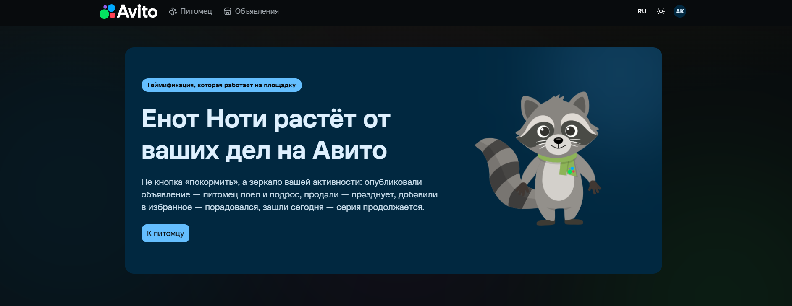
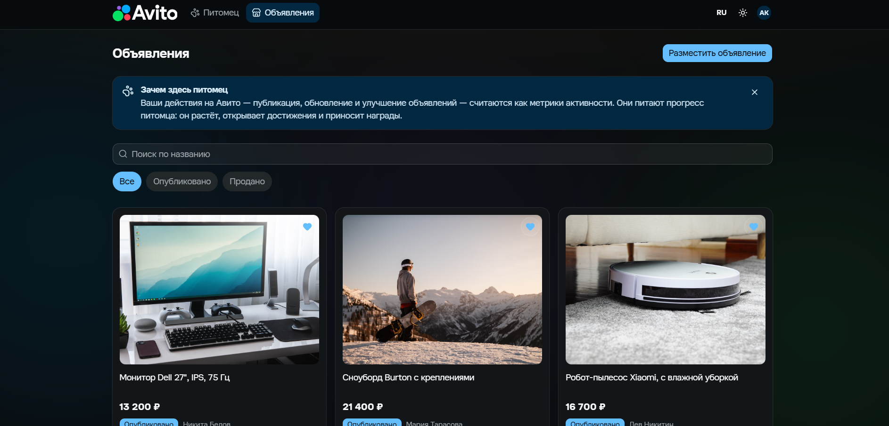
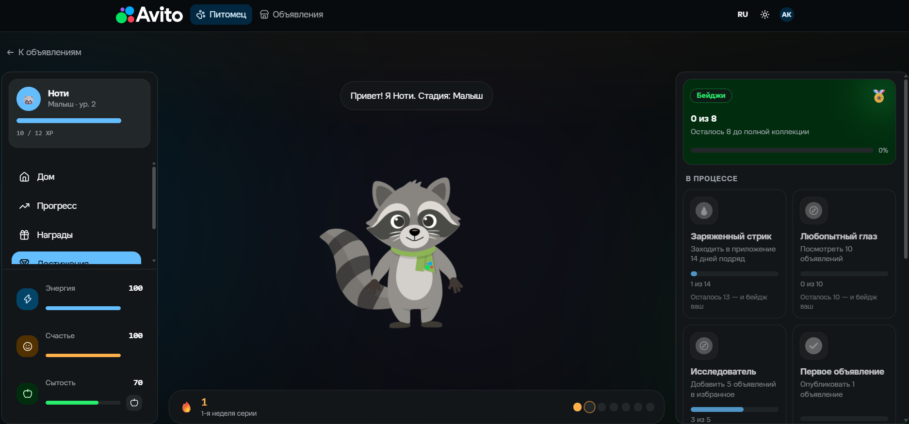
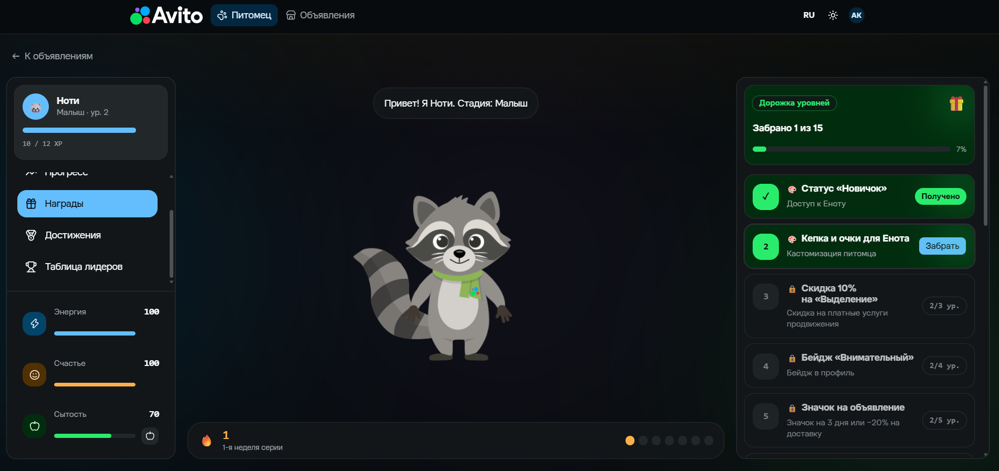

# Авито Тамагочи — «Енот Ноти»
<h1 align="center">Авито Тамагочи — Енот Ноти</h1>

<p align="center">
  Питомец, который растёт от реальных действий пользователя на Авито
</p>

<p align="center">
  <a href="https://go.dev/">
    
  </a>
  <a href="https://react.dev/">
    
  </a>
  <a href="https://www.postgresql.org/">
    
  </a>
  <a href="https://redis.io/">
    
  </a>
  <a href="https://kafka.apache.org/">
    
  </a>
  <a href="./LICENSE">
    
  </a>
</p>

<p align="center">
  
</p>

Геймификация поверх доски объявлений. Виртуальный енот растёт не от кнопки «покормить», а от
**реальных действий пользователя на Авито**: публикаций объявлений, продаж, добавлений в
избранное, ежедневных заходов. Награды за уровни конвертируются обратно в продукт — промокоды
на доставку, скидки на продвижение и Автотеку.

Ключевая продуктовая идея: **питомец — зеркало активности пользователя, а не отдельная игра.**
Опубликовал объявление — енот поел и подрос. Не заходил два дня — загрустил и проголодался.
Заполнил объявление качественно (фото, цена, подробное описание) — вырос быстрее. Так игровая
петля напрямую тянет метрики площадки: публикации, качество контента, возвращаемость.

| Документ | О чём |
| --- | --- |
| [docs/CASE.md](docs/CASE.md) | Разбор кейса и продуктовое обоснование |
| [docs/API.md](docs/API.md) | Спецификация HTTP API и WebSocket с примерами `curl` |
| [docs/openapi.yaml](docs/openapi.yaml) | Машиночитаемый контракт API, OpenAPI 3.1 |
| [deploy/README.md](deploy/README.md) | Деплой на VPS с HTTPS |

---

## Быстрый старт

Нужны только **Docker** и **Docker Compose v2**. Ни Go, ни Node.js локально не требуются —
всё собирается в контейнерах.

```bash
git clone https://github.com/GoatWhistle/avito-hack.git
cd avito-hack
cp .env.example .env
docker compose up -d --build
```

Больше ничего заполнять не нужно: `.env.example` содержит рабочие локальные значения.
Для стенда, доступного извне, замените `POSTGRES_PASSWORD`, `JWT_SECRET` и
`REWARD_HMAC_SECRET` — образец с требованиями лежит в `.env.production.example`.

Первая сборка занимает 3–5 минут. Compose сам выдерживает порядок запуска: postgres → миграции
→ бэкенд → фронтенд. Kafka вынесена в профиль и по умолчанию **не поднимается** — события
доставляются внутрипроцессной шиной, демо от брокера не зависит.

| Что | Адрес |
| --- | --- |
| Фронтенд | `http://localhost:3000` |
| API | `http://localhost:8080/api/v1` |
| Health | `http://localhost:8080/healthz` |
| Readiness (пингует БД) | `http://localhost:8080/readyz` |
| Метрики Prometheus | `http://localhost:8080/metrics` |

Проверить, что всё поднялось:

```bash
curl http://localhost:8080/healthz   # {"status":"ok"}
curl http://localhost:8080/readyz    # {"status":"ready"}
```

Остановить: `docker compose down`. Стереть данные вместе с томами: `docker compose down -v`.

### Демо-аккаунты

Миграция `00005_seed_demo_data.sql` заполняет лидерборд двенадцатью пользователями — питомцы
покрывают все четыре стадии, от малыша до легенды. Пароль у всех один: **`demo1234`**.

| Аккаунт | Имя | Стадия | Ур. | XP | Серия | Бейджи |
| --- | --- | --- | --- | --- | --- | --- |
| `anna@demo.avito` | Анна Ковалёва | legend | 15 | 455 | 41 дн. | 3 |
| `boris@demo.avito` | Борис Гурьев | adult | 13 | 312 | 22 дн. | 2 |
| `vera@demo.avito` | Вера Синицына | adult | 12 | 265 | 17 дн. | 2 |
| `gleb@demo.avito` | Глеб Мартынов | adult | 11 | 208 | 14 дн. | 1 |
| `dasha@demo.avito` | Дарья Лебедева | adult | 10 | 168 | 11 дн. | 1 |
| `egor@demo.avito` | Егор Полянский | teen | 8 | 104 | 8 дн. | 1 |
| `zhanna@demo.avito` | Жанна Орлова | teen | 7 | 85 | 6 дн. | 1 |
| `ivan@demo.avito` | Иван Дорофеев | teen | 6 | 58 | 4 дн. | 0 |
| `kira@demo.avito` | Кира Ефимова | baby | 4 | 27 | 3 дн. | 1 |
| `lev@demo.avito` | Лев Никитин | baby | 3 | 15 | 2 дн. | 0 |
| `maria@demo.avito` | Мария Тарасова | baby | 2 | 7 | 1 дн. | 0 |
| `nikita@demo.avito` | Никита Белов | baby | 1 | 0 | — | 0 |

Что удобно показывать под каким аккаунтом:

- `anna@demo.avito` — максимальный уровень, корона легенды, длинная серия и первое место
  в рейтинге; лучший аккаунт для обзора всех разделов;
- `egor@demo.avito` — середина пути: виден прогресс до следующего уровня и незакрытые награды;
- `nikita@demo.avito` — самое начало: пустые достижения и ежедневные задания с нуля.

### Демо-сценарий за две минуты

1. Открыть `http://localhost:3000`, зарегистрировать нового пользователя. Питомец появляется
   сразу — маленький енот первого уровня.
2. Перейти в объявления, создать своё: заголовок, цена, описание, фото.
3. Опубликовать. По WebSocket приходит событие: **опыт начисляется на глазах**, растёт
   уровень, енот подрастает.
4. На экране питомца видно полосу XP, сытость, настроение, энергию и серию заходов.
5. На странице наград — выданные за уровни промокоды. Активация выдаёт подписанный код.
6. Лидерборд показывает позицию пользователя и соседей по рейтингу.

<p align="center">
  
</p>

---

## Технологии

### Бэкенд

| Технология | Зачем |
| --- | --- |
| Go 1.25 | Основной язык сервиса |
| chi v5 | HTTP-роутер и middleware |
| PostgreSQL 16 + pgx/v5 | Основное хранилище, пул соединений |
| goose v3 | Миграции, встроены в бинарник через `embed` |
| Redis 7 | Кеш питомца и «горячее» состояние параметров |
| coder/websocket | WebSocket-хаб для событий реального времени |
| golang-jwt/v5 | JWT-аутентификация |
| Apache Kafka 3.9 | Асинхронная доставка событий (опциональный профиль) |
| Prometheus client | Метрики на `/metrics` |
| validator/v10 | Валидация входящих DTO |
| golang.org/x/crypto | bcrypt для паролей |
| testify | Тесты |

### Фронтенд

| Технология | Зачем |
| --- | --- |
| React 19 | UI |
| React Router 8 | Роутинг и SSR-сборка |
| TypeScript 6 | Типизация |
| Tailwind CSS 4 | Стили, генерация из дизайн-токенов |
| shadcn + Base UI | Библиотека компонентов |
| TanStack Query 5 | Серверное состояние, кеш, инвалидация |
| TanStack Form | Формы |
| zod 4 | Валидация ответов API на границе |
| axios | HTTP-клиент с интерсепторами |
| i18next + react-i18next | Локализация ru/en |
| Lottie, lucide-react | Анимации и иконки |
| Vite 8, Vitest 4, MSW | Сборка и тесты с моками сети |

### Инфраструктура

Docker и Docker Compose, nginx как раздатчик статики и обратный прокси, GitHub Actions для CI,
golangci-lint и ESLint + Prettier для статического анализа, pre-commit для локальных проверок.

---

## Структура проекта

```text
.
├── docker-compose.yml            базовый стек: postgres, redis, kafka (профиль), migrate, backend, frontend
├── docker-compose.dev.yml        оверлей для разработки с горячей перезагрузкой
├── docker-compose.prod.yml       прод-оверлей: nginx, без публикации внутренних портов
├── Makefile                      init, lint, test, up, down, migrate, seed, psql, prod-*
├── deploy/                       nginx-конфиги, шаблон TLS, скрипт включения HTTPS
├── docs/                         разбор кейса, спецификация API, требования к сдаче
├── scripts/                      длина файлов, синхронность локалей, генерация OpenAPI
├── tests/integration/            сквозной тест против поднятого стека, отдельный go-модуль
└── src
    ├── backend
    │   ├── cmd/api               точка входа: main, сборка модулей, фоновые задачи
    │   ├── cmd/migrate           отдельный бинарник для контейнера миграций
    │   ├── migrations            SQL-миграции goose, встроенные через embed
    │   ├── tools/openapigen      слияние спеки swaggo с накладкой
    │   └── internal
    │       ├── config            загрузка и валидация переменных окружения
    │       ├── server            роутер, health/ready, раздача загруженных фото
    │       ├── module            бизнес-модули (см. ниже)
    │       └── shared            auth, events, kafka, ws, postgres, pagination,
    │                             httpx, apierr, domainerr, middleware, validate,
    │                             logger, clock, password, llm, vo
    └── frontend
        ├── app
        │   ├── api               HTTP-клиент, хранилище токена, маппинг ошибок,
        │   │                     generated/ — клиент из docs/openapi.yaml
        │   ├── components        UI-кит (ui) и персонаж питомца (pet-avatar):
        │   │                     Lottie-обёртка, стадии, слежение за курсором
        │   ├── features          landing, auth, items, favorites, pet (включая
        │   │                     трёхколоночный дашборд), rewards, leaderboard,
        │   │                     progress, onboarding, profile, layout
        │   ├── i18n              конфигурация и локали ru/en
        │   ├── routes            лендинг, вход и регистрация, питомец, объявления
        │   │                     и их создание/правка, избранное, награды,
        │   │                     лидерборд, онбординг, профиль
        │   ├── providers         провайдеры запросов, сессии, темы
        │   ├── lib, types        утилиты и общие типы
        │   ├── styles            глобальные стили и сгенерированный CSS токенов
        │   └── tokens            дизайн-токены, из которых генерируется CSS
        ├── public/lottie         анимации енота от дизайнера (стадии teen, adult)
        ├── scripts               генерация токенов, проверка контраста
        └── Dockerfile            сборка и раздача через nginx
```

### Модули бэкенда

Каждый модуль повторяет одну и ту же раскладку слоёв: `api` (HTTP-хендлеры и DTO) → `app`
(сценарии) → `domain` (правила, без зависимостей на инфраструктуру) → `infra` (PostgreSQL,
Redis). Точка сборки — `module.go` с функцией `New(Options)`; все модули собираются в
`cmd/api/modules.go`.

| Модуль | Ответственность |
| --- | --- |
| `user` | Регистрация, вход, профиль |
| `item` | Объявления: черновик, публикация, продажа, архив, фотографии |
| `favorite` | Избранное |
| `pet` | Питомец, экономика XP, уровни, серии, награды, лидерборд, WebSocket |
| `raccoon` | Агрегирующий фасад: профиль питомца с бейджами, выдача промокода |

---

## API

Базовый префикс — `/api/v1`. Аутентификация: `Authorization: Bearer <token>`, токен выдаётся
эндпоинтом входа. Срок жизни токена — в клейме `exp` внутри JWT, отдельного поля в ответе нет.

| Метод | Путь | Авторизация | Назначение |
| --- | --- | --- | --- |
| `POST` | `/auth/register` | — | Регистрация, сразу возвращает токен и пользователя |
| `POST` | `/auth/login` | — | Вход, возвращает токен и пользователя |
| `GET` | `/users/me` | да | Текущий пользователь |
| `PATCH` | `/users/me` | да | Изменение имени |
| `GET` | `/items` | опционально | Лента объявлений, keyset-пагинация |
| `POST` | `/items` | да | Создание объявления |
| `GET` | `/items/mine` | да | Свои объявления, включая черновики |
| `GET` | `/items/{id}` | опционально | Объявление целиком |
| `PATCH` | `/items/{id}` | да | Правка своего объявления |
| `POST` | `/items/{id}/status` | да | Смена статуса: `submit`, `publish`, `sell`, `archive`, `restore` |
| `GET` | `/items/{id}/photos` | опционально | Фотографии объявления |
| `POST` | `/items/{id}/photos` | да | Загрузка фотографии |
| `DELETE` | `/items/{id}/photos/{photoID}` | да | Удаление фотографии |
| `GET` | `/favorites` | да | Избранное |
| `POST` | `/items/{id}/favorite` | да | Добавить в избранное |
| `DELETE` | `/items/{id}/favorite` | да | Убрать из избранного |
| `GET` | `/pet` | да | Питомец с пересчитанными на текущий момент параметрами |
| `POST` | `/pet/actions/stroke` | да | Погладить питомца |
| `POST` | `/checkin` | да | Ежедневный чек-ин, продлевает серию |
| `GET` | `/progress` | да | Уровень, XP, сколько до следующего уровня, серия |
| `GET` | `/rewards` | да | Каталог наград |
| `GET` | `/rewards/my` | да | Выданные пользователю награды |
| `POST` | `/rewards/{id}/activate` | да | Активация награды, выдаёт подписанный промокод |
| `POST` | `/rewards/claim` | да | Получение промокода по идентификатору награды |
| `GET` | `/leaderboard` | да | Рейтинг с позицией пользователя, keyset-пагинация |
| `GET` | `/summary/today` | да | Сводка дня от питомца, генерируется при первом запросе |
| `GET` | `/summary/history` | да | История сводок, keyset-пагинация |
| `GET` | `/raccoon/profile` | да | Профиль питомца вместе с бейджами |
| `GET` | `/badges` | да | Бейджи пользователя |
| `GET` | `/ws` | да, токен параметром | WebSocket с событиями питомца |

Цена объявления передаётся и возвращается в поле `price` (целое число копеек). Подробности со
схемами запросов, ответов и примерами `curl` — в [docs/API.md](docs/API.md).

### Спецификация OpenAPI

Машиночитаемый контракт всего API, включая служебные маршруты и WebSocket, лежит в
[`docs/openapi.yaml`](docs/openapi.yaml) (OpenAPI 3.1).

**Файл генерируется, править его руками не нужно.** Источники два:

- аннотации [swaggo](https://github.com/swaggo/swag) над обработчиками в `src/backend`
  (`// @Summary`, `// @Router` и прочие) — из них берутся маршруты, схемы запросов
  и ответов, коды и параметры;
- [`docs/openapi.overlay.yaml`](docs/openapi.overlay.yaml) — накладка с тем, чего в Go-коде
  нет: описание WebSocket-протокола, служебные маршруты `/healthz`, `/readyz`, `/metrics`
  и `/uploads/...` (у них нет именованных обработчиков), общие `components/parameters`
  и `components/responses`, перечисления вроде `ItemStatus`.

Перегенерировать после изменения аннотаций:

```bash
make api-spec
```

Цель вызывает `scripts/generate-openapi.sh`: он запускает `swag init --v3.1`
(swaggo v2 умеет OpenAPI 3.1 напрямую, конвертация из Swagger 2.0 не нужна), а затем
`src/backend/tools/openapigen` сливает результат с накладкой и приводит имена схем
к тем, что ожидает фронтенд.

Если Go локально не установлен, тот же результат даёт запуск в контейнере:

```bash
docker run --rm -v "$PWD:/repo" -w /repo/src/backend golang:1.25-alpine \
  sh -c 'apk add --no-cache bash grep >/dev/null && bash /repo/scripts/generate-openapi.sh'
```

После правки спецификации имеет смысл обновить и клиент фронтенда — `make api-generate`.

Полнота контракта закреплена тестами `TestOpenAPICoversEveryRegisteredRoute` и
`TestOpenAPIDeclaresNoUnknownRoute` в `internal/server`: если у нового маршрута забыть
аннотацию, тесты упадут.

Посмотреть в браузере, без установки чего-либо в проект:

```bash
docker run --rm -p 8081:8080 \
  -e SWAGGER_JSON=/spec/openapi.yaml \
  -v "$PWD/docs:/spec:ro" swaggerapi/swagger-ui
```

Спецификация откроется на `http://localhost:8081`. Альтернатива — расширение Redoc или
OpenAPI для редактора.

Сгенерировать из неё типы TypeScript для фронтенда:

```bash
npx openapi-typescript docs/openapi.yaml -o src/frontend/app/types/api.generated.ts
```

Сгенерированные файлы намеренно исключены из проверки длины файлов
(`scripts/check-file-length.sh` отбрасывает `*.generated.*`), поэтому большой артефакт не
сломает линт.

---

## Особенности реализации

### Опыт только за реальные действия, с потолками против накрутки

Питомец растёт от того, что пользователь делает на площадке, а не от кликов по кнопке. Каждое
действие имеет цену в опыте и суточный потолок, поэтому уровень нельзя нафармить перезагрузкой
страницы.

| Действие | XP | Потолок в сутки | Защита |
| --- | --- | --- | --- |
| Публикация объявления | 50 | 3 | по объявлению |
| Продажа | 100 | 5 | по объявлению |
| Улучшение объявления | 15 | 3 | только при реальном добавлении фото, описания или цены |
| Обновление объявления | 5 | 5 | по объявлению |
| Качественное объявление | 2 | — | требует фото, цену и описание длиннее 200 символов |
| Добавление в избранное | 1 | 5 | по объявлению |
| Просмотр объявления | 1 | 10 | по объявлению, свои не считаются |
| Ежедневный заход | 1 (×1.5 при серии от 7 дней) | 1 | по дате |

Действия, которых в продукте нет (переписка, отзывы, видео), из экономики удалены — вместе с
бейджами, которые невозможно было получить.

<p align="center">
  
</p>

### Ежедневные задания

Три задания в день, детерминированные от пары «пользователь + дата»: состав не меняется при
каждом запросе и одинаков в течение суток. Прогресс не хранится отдельным счётчиком, а
считается из журнала `xp_events` — рассинхронизировать его нечем. Награда за выполнение
идемпотентна: защиту даёт уникальный индекс `(user_id, action, subject_id)`, а не проверка
в коде, поэтому повторный запрос ничего не начислит даже при гонке.

### События вместо прямых зависимостей между модулями

Модуль `item` ничего не знает о питомце. При публикации или продаже объявления он публикует
доменное событие (`item.published`, `item.sold`, `favorite.added`, `user.registered`) во
внутрипроцессную шину `internal/shared/events`. Модуль `pet` — единственный подписчик: он
конвертирует событие в опыт, изменение параметров и WebSocket-уведомление. Направление
зависимостей одностороннее, новое целевое действие площадки подключается как новое событие без
правки уже написанных модулей.

Событие публикуется **после коммита транзакции** — питомец не получает опыт за операцию, которая
откатилась.

### Ленивый пересчёт параметров без фоновых задач

Сытость, настроение и энергия падают со временем, но в базе не крутится ни одного планировщика,
обходящего всех питомцев. Хранится значение параметра и метка `last_decay_time`; при каждом
чтении домен пересчитывает деградацию от прошедшего времени. Стоимость не зависит от числа
пользователей, а при простое сервиса состояние не «замерзает».

Единственная фоновая задача — периодический сброс «горячего» состояния из Redis в PostgreSQL
(`PET_FLUSH_INTERVAL`, `PET_FLUSH_BATCH_SIZE`), и она пакетная.

### Безопасность наград: подпись промокодов HMAC

Промокод награды подписывается HMAC на секрете `REWARD_HMAC_SECRET` и привязан к пользователю.
Код нельзя подобрать, переиспользовать на другом аккаунте или активировать дважды: повторная
активация отсекается на уровне домена и уникального индекса. Секрет обязателен при старте —
сервис не поднимется с пустым значением.

### Keyset-пагинация

Списки объявлений и лидерборд листаются курсором (`internal/shared/pagination`), а не `OFFSET`.
Курсор кодирует пару «сортировочный ключ + идентификатор», поэтому глубокие страницы стоят
столько же, сколько первая, и вставка новых записей не сдвигает выдачу.

### Слоистая архитектура с проверкой границ линтером

Каждый модуль разложен на `api` / `app` / `domain` / `infra`. Правило «домен не знает об
инфраструктуре» не держится на договорённостях: границы импортов проверяет `depguard` в
`.golangci.yaml`, а `scripts/check-file-length.sh` не даёт файлам разрастаться свыше лимита.
Комментариев в коде нет намеренно — именование должно объяснять само себя.

### Живой персонаж

Питомца рисует `PetCharacter` (`app/components/pet-avatar`): векторные Lottie-анимации
от дизайнера (`public/lottie/`), стадия задаёт масштаб и регалии. Плеер и WASM-модуль лежат
локально, поэтому анимация работает без интернета. Если файл не загрузился, показывается
плейсхолдер с подписью, а не пустое место.

Персонаж не статичная картинка: облик меняется со стадией роста, микровзаимодействия реагируют
на пользователя, а поглаживание — это клик по самому еноту, не по кнопке рядом. Взаимодействие
доступно и с клавиатуры (Enter, Space), и на тач-устройствах. Реалтайм-события с бэкенда
(начисление опыта, повышение уровня, новые награды) приходят по WebSocket и проигрываются без
перезагрузки страницы.

<p align="center">
  
</p>

### Ежедневная сводка от питомца

Требование кейса «что изменилось за день» решено не таблицей, а сообщением от питомца от первого
лица. Сводка собирается лениво при первом запросе `GET /api/v1/summary/today`: агрегируются
события XP за день, изменения параметров, выданные награды и позиция в лидерборде. Поверх фактов
формируется текст и **ровно один конкретный совет** с `item_id` — например «у объявления нет ни
одной фотографии». Совет ведёт прямо к объявлению, то есть конвертируется в целевое действие.

Факты детерминированы и хранятся в `daily_summaries` рядом с текстом: прогрессия не зависит от
генератора текста. В текущей сборке сводка собирается шаблонным генератором — в ответе это видно
по полю `generated_by: "template"`. Клиент к Anthropic API написан
(`internal/shared/llm`), но в сборку приложения не подключён.

### Kafka под профилем, демо от брокера не зависит

Kafka объявлена в `docker-compose.yml` с профилем `kafka` и по умолчанию не поднимается. Если
`KAFKA_BROKERS` пуст, события идут внутрипроцессной шиной. Если брокер объявлен, но недоступен,
сервис пишет предупреждение и **продолжает работать** на внутренней шине вместо падения.
Асинхронный путь идемпотентен: повторная доставка отсекается дедупликацией через таблицу
`pet_processed_events`.

Поднять стек вместе с брокером:

```bash
docker compose --profile kafka up -d --build
```

### Прочее

- Загруженные фотографии раздаются не напрямую: перед отдачей файла проверяется, что объявление
  существует и опубликовано.
- Логи структурированные (`log/slog`), в разработке — человекочитаемый цветной формат.
- Метрики HTTP-слоя отдаются в Prometheus-формате на `/metrics`.
- Локали `ru` и `en` проверяются на синхронность скриптом `scripts/check-locales.mjs`.
- Контраст цветов дизайн-токенов проверяется скриптом `npm run contrast`.

---

## Ограничения MVP

Зафиксировано честно, чтобы не искать в коде того, чего нет.

| Ограничение | Причина |
| --- | --- |
| Отдельного refresh-токена нет: сессия продлевается скользящим окном, истёкший токен требует повторного входа | `POST /api/v1/auth/refresh` обменивает живой токен на новый, `JWT_TTL` по умолчанию 1 час; хранилища refresh-токенов и ревокации в MVP нет |
| Промокоды активируются внутри приложения, а не в реальном промо-сервисе Авито | Внешней интеграции нет и быть не может в рамках хакатона; статус награды меняется на `activated` |
| Мультиаккаунты не отслеживаются | В проде понадобился бы фингерпринт устройства или подтверждение телефона |
| «День» считается по московскому времени для всех пользователей | Пользовательских часовых поясов в модели нет |
| WebSocket-хаб живёт в памяти процесса | Один инстанс бэкенда; для нескольких понадобился бы Redis pub/sub |
| Диалоги, отзывы и подписки на поиск не начисляют опыт | Правила экономики написаны и покрыты тестами, но соответствующих модулей в MVP нет |
| Задания дня и действия «поиграть» / «покормить» не реализованы | Доступно только «погладить»; см. [docs/API.md](docs/API.md), раздел «Что ещё не реализовано» |
| Текст ежедневной сводки собирается шаблонами, не LLM | Клиент к Anthropic API написан, но в сборку не подключён; факты и советы детерминированы в любом случае |

## Использование ИИ

Прозрачность по требованию кейса:

- **В продукте.** Ежедневная сводка строится поверх детерминированных фактов из БД: текст и совет
  только «озвучивают» уже посчитанные значения, на прогрессию и выдачу наград повлиять не могут.
  В текущей сборке текст собирается шаблонным генератором; клиент к Anthropic API и промпт лежат
  в `src/backend/internal/shared/llm`.
- **В разработке.** Claude Code применялся для генерации кода, тестов и документации. Продуктовые
  решения, архитектура и ревью — командные.

## Разработка

```bash
make help            # список целей
make init            # .env и зависимости
make dev             # стек с горячей перезагрузкой бэкенда и фронтенда
make lint            # golangci-lint, ESLint, typecheck, длина файлов, локали
make test            # тесты бэкенда и фронтенда с покрытием
make migrate-status  # какие миграции применены
make seed            # перезалить демо-данные
make psql            # psql внутри контейнера базы
```

Локально без Docker понадобятся Go 1.25 и Node.js 22+.

### Переменные окружения

Полный список с дефолтами — в [`.env.example`](.env.example), разбор для продакшена — в
[`.env.production.example`](.env.production.example). Обязательные:

| Переменная | Назначение |
| --- | --- |
| `POSTGRES_PASSWORD` | Пароль базы, должен совпадать с паролем внутри `DATABASE_URL` |
| `DATABASE_URL` | Строка подключения к PostgreSQL |
| `JWT_SECRET` | Секрет подписи токенов, не короче 16 символов |
| `REWARD_HMAC_SECRET` | Секрет подписи промокодов, не короче 16 символов |

Остальное имеет рабочие значения по умолчанию: `REDIS_ADDR`, `JWT_TTL`, `ALLOWED_ORIGINS`,
`LOG_LEVEL`, `LOG_FORMAT`, `LOG_COLOR`, `KAFKA_*`, `PET_FLUSH_*`, таймауты HTTP-сервера,
`MAX_BODY_BYTES`, `MAX_PHOTO_BYTES`, `UPLOAD_DIR`, `UPLOAD_URL`, `VITE_API_URL`,
`VITE_DEFAULT_LOCALE`.

Значения в `.env.example` рабочие: `cp .env.example .env && docker compose up -d --build`
поднимает стек без единой правки. Это локальные учебные секреты — для стенда, доступного
извне, замените `POSTGRES_PASSWORD`, `JWT_SECRET` и `REWARD_HMAC_SECRET` (см.
`.env.production.example`) и не забудьте про пароль внутри `DATABASE_URL`.

Три вещи, которые чаще всего понимают неправильно:

- **`VITE_API_URL` пуст намеренно.** Фронт ходит на API относительными путями, а nginx рядом
  проксирует `/api/` и `/uploads/` на `backend:8080`. Благодаря этому стенд одинаково
  открывается по `localhost:3000`, `127.0.0.1:3000` и по доменному имени, пересборка при смене
  хоста не нужна, а запросы остаются same-origin. Абсолютный URL задавайте, только если API
  живёт на другом origin. Все `VITE_*` — build-time: правка `.env` без пересборки фронтенда
  ничего не изменит.
- **В `ALLOWED_ORIGINS` перечислены и `localhost`, и `127.0.0.1`.** Для браузера это разные
  origin. Список нужен не фронту (его запросы same-origin и под CORS не попадают), а прямым
  обращениям к порту 8080 — Swagger UI, curl из devtools, сторонний фронтенд. Он же используется
  при проверке Origin на WebSocket-рукопожатии.
- **`DB_MIN_CONNS` не должен превышать `DB_MAX_CONNS`** — иначе `Load()` вернёт ошибку и
  контейнер уйдёт в рестарт-луп. Суммарный `DB_MAX_CONNS` по всем инстансам не должен
  превышать `max_connections` постгреса.

Подробный разбор всех переменных, включая пул подключений, лимиты загрузки и Kafka —
в [`deploy/README.md`](deploy/README.md), раздел «Переменные окружения подробно».

### Миграции

Миграции goose лежат в `src/backend/migrations` и вшиты в бинарник через `embed`, так что
отдельный контейнер `migrate` не нуждается в примонтированных файлах.

| Файл | Что создаёт |
| --- | --- |
| `00001_create_users.sql` | Пользователи |
| `00002_create_items.sql` | Объявления и фотографии |
| `00003_create_pets.sql` | Питомцы |
| `00004_create_gamification.sql` | Журнал XP, награды, выдачи |
| `00005_seed_demo_data.sql` | Демо-данные для жюри |
| `00006_create_pet_processed_events.sql` | Дедупликация асинхронных событий |
| `00007_add_pet_interaction_version.sql` | Версия для оптимистичных блокировок |
| `00009_create_daily_summaries.sql` | Хранилище ежедневных сводок |

Номер `00008` не занят: миграция была отброшена при сведении веток, а нумерацию уже применённых
файлов goose менять нельзя. Пропуск на работу не влияет.

---

## Качество и CI

- Тесты бэкенда — `go test -race` с профилем покрытия; тесты фронтенда — Vitest с MSW вместо
  реальной сети. Покрытие: **бэкенд 87%**, **фронтенд 87.9%** строк (80.4% ветвей, 82.4%
  функций). Порог 80% проверяется в CI и роняет сборку при просадке.
- Сквозной интеграционный тест в `tests/integration/` — отдельный модуль под тегом
  `integration`: регистрация → публикация → опыт → уровень → награда → активация промокода →
  повторная активация отклонена. Пропускается, если стенд не поднят.
- `golangci-lint` с конфигурацией `.golangci.yaml`, включая контроль границ импортов.
- ESLint 10 и Prettier, отдельная проверка типов `react-router typegen && tsc`.
- Ограничение длины файлов и проверка синхронности локалей — в `make lint`.
- Хуки pre-commit (`.pre-commit-config.yaml`) прогоняют то же самое до коммита.
- GitHub Actions: отдельные workflow на бэкенд, фронтенд, сборку образов, качество кода и
  smoke-прогон стека — `.github/workflows/`.

---

## Команда и распределение ответственности

| Участник | Роль | Зона ответственности |
| --- | --- | --- |
| [Владимир Антыгин](https://github.com/hel1th) | Бэкенд: домен питомца | Модуль `pet`: доменная модель, параметры и их ленивая деградация, стадии и состояния, экономика опыта и уровни, серии заходов с заморозками, каталог и выдача наград, подпись промокодов HMAC, лидерборд. Юнит-тесты домена |
| [Калинин Артём](https://github.com/curboturbo) | Бэкенд: интеграции и реалтайм | Шина событий и связка модулей без прямых зависимостей, Kafka-продюсер и идемпотентный консьюмер, дедупликация событий, Redis hot-state и пакетный сброс в PostgreSQL, WebSocket-хаб и доставка событий клиенту |
| [Никита Денисов](https://github.com/FaraneysX) | Фронтенд | Дизайн-система и токены, экраны питомца, наград, лидерборда и объявлений, живой Lottie-персонаж и микровзаимодействия, WebSocket-клиент с переподключением, TanStack Query и валидация ответов через zod, локализация ru/en, тесты Vitest |
| [Михаил Хорохорин](https://github.com/mikhailkhorokhorin) | Фуллстек и инфраструктура | Модули `user`, `item`, `favorite`, загрузка фотографий и защищённая раздача, миграции и демо-данные, Docker Compose для разработки и продакшена, nginx и HTTPS, CI и линтеры, документация |

## Лицензия

[MIT](LICENSE).
